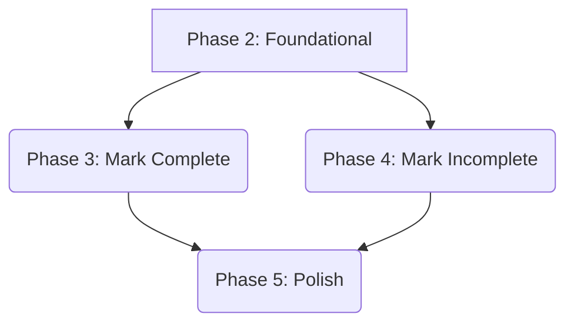

# Tasks for Feature: Mark Todo as Complete / Incomplete

**Branch**: `003-mark-todo-status` | **Date**: 2025-12-28 | **Plan**: specs/003-mark-todo-status/plan.md
**Feature**: Mark Todo as Complete / Incomplete
**Input**: Implementation plan from `/specs/003-mark-todo-status/plan.md`

## Summary

This document outlines the development tasks for the "Mark Todo as Complete / Incomplete" feature. Tasks are organized into phases, prioritizing foundational logic and then user stories, with considerations for parallel execution and cross-cutting concerns like error handling.

## Task Overview

*   **Total Tasks**: 14
*   **Tasks per User Story**:
    *   User Story 1 (Mark Todo as Complete): 4 tasks
    *   User Story 2 (Mark Todo as Incomplete): 3 tasks
*   **Parallel Opportunities**: Significant parallelism possible in integration tests and independent error handling.
*   **Suggested MVP Scope**: Completion of Phase 2 (Foundational) and Phase 3 (User Story 1 - Mark Todo as Complete).

## Phase 1: Setup

(No specific setup tasks needed beyond what's already done in previous steps or covered by quickstart)

## Phase 2: Foundational (Blocking Prerequisites)

Goal: Implement the core service logic for updating a todo item's status.
Independent Test Criteria: The `update_todo_status` method in `TodoService` correctly modifies a todo's completion status and handles non-existent IDs, as verified by unit tests.

- [X] T001 Add a method `update_todo_status(todo_id: int, completed: bool)` to `TodoService` that finds a todo by `todo_id` and sets its `completed` attribute. Raise a `ValueError` if the `todo_id` is not found. (`src/todo/service.py`)
- [X] T002 Add a unit test for the `update_todo_status` method in `src/todo/service.py` to ensure it correctly updates a todo's status from incomplete to complete, and vice-versa. (`tests/unit/test_service.py`)
- [X] T003 Add a unit test for the `update_todo_status` method in `src/todo/service.py` to ensure it raises a `ValueError` when a non-existent `todo_id` is provided. (`tests/unit/test_service.py`)

## Phase 3: User Story 1 - Mark Todo as Complete [US1] (P1)

Goal: Implement CLI functionality to mark a todo as complete and verify its behavior.
Independent Test Criteria: The CLI command `todo mark-status <ID> --status complete` successfully updates a todo's status and provides correct feedback, both for existing and non-existent todos.

- [X] T004 [US1] Modify `cli.py` to add a new `mark-status` sub-command to the `ArgumentParser`. (`src/todo/cli.py`)
- [X] T005 [P] [US1] Implement the logic in `cli.py` for the `mark-status` sub-command to parse the `ID` and `--status complete` argument. It should call the `update_todo_status` service method and print a success message. (`src/todo/cli.py`)
- [ ] T006 [P] [US1] Add an integration test for `cli.py` to verify that `todo mark-status <ID> --status complete` successfully marks an existing todo as complete and prints the correct confirmation message. (`tests/integration/test_cli.py`)
- [ ] T007 [P] [US1] Add an integration test for `cli.py` to verify that `todo mark-status <ID> --status complete` for a non-existent ID prints the "Todo not found" error message. (`tests/integration/test_cli.py`)

## Phase 4: User Story 2 - Mark Todo as Incomplete [US2] (P1)

Goal: Implement CLI functionality to mark a todo as incomplete and verify its behavior.
Independent Test Criteria: The CLI command `todo mark-status <ID> --status incomplete` successfully updates a todo's status and provides correct feedback, both for existing and non-existent todos.

- [ ] T008 [P] [US2] Extend the logic in `cli.py` for the `mark-status` sub-command to handle `--status incomplete` argument. It should call the `update_todo_status` service method and print a success message. (`src/todo/cli.py`)
- [ ] T009 [P] [US2] Add an integration test for `cli.py` to verify that `todo mark-status <ID> --status incomplete` successfully marks an existing todo as incomplete and prints the correct confirmation message. (`tests/integration/test_cli.py`)
- [ ] T010 [P] [US2] Add an integration test for `cli.py` to verify that `todo mark-status <ID> --status incomplete` for a non-existent ID prints the "Todo not found" error message. (`tests/integration/test_cli.py`)

## Phase 5: Polish & Cross-Cutting Concerns

Goal: Ensure robust error handling and CLI stability for the `mark-status` command.
Independent Test Criteria: Invalid ID formats and invalid status inputs are gracefully handled, producing user-friendly error messages without crashing the application.

- [ ] T011 Add error handling in `cli.py` for `mark-status` to catch `ValueError` if the `ID` is not a valid integer, printing a user-friendly error message. (`src/todo/cli.py`)
- [ ] T012 Add an integration test for `cli.py` to verify that `todo mark-status abc --status complete` prints an error for an invalid ID format. (`tests/integration/test_cli.py`)
- [ ] T013 Add error handling in `cli.py` for `mark-status` to validate that the `--status` argument is either 'complete' or 'incomplete', printing a user-friendly error message for invalid values. (`src/todo/cli.py`)
- [ ] T014 Add an integration test for `cli.py` to verify that `todo mark-status 1 --status invalid` prints an error for an invalid status input. (`tests/integration/test_cli.py`)

## Implementation Strategy

The implementation will follow an iterative approach, delivering user stories in priority order. After completing foundational tasks, User Story 1 (Mark Todo as Complete) will be prioritized as the Minimum Viable Product (MVP). User Story 2 (Mark Todo as Incomplete) will then follow, building on the established patterns. Polish and cross-cutting concerns will be addressed incrementally throughout development and in the final phase.

## Dependency Graph

## Parallel Execution Examples

After completing all tasks in Phase 2 (Foundational - T001-T003):

*   **Scenario 1 (Max Parallelism)**:
    *   **Developer A**: Works on `cli.py` integration for 'complete' status (T004, T005), and its integration tests (T006, T007).
    *   **Developer B**: Works on `cli.py` integration for 'incomplete' status (T008), and its integration tests (T009, T010).
    *   **Developer C**: Works on generic error handling for `cli.py` (T011, T013) and their respective integration tests (T012, T014).

*   **Scenario 2 (Iterative with some Parallelism)**:
    1.  Complete all tasks in Phase 2.
    2.  Complete all tasks in Phase 3 (Mark Complete - T004-T007).
    3.  Developer A (or B) works on tasks T008-T010 (Mark Incomplete).
    4.  Developer B (or A) works on tasks T011-T014 (Polish & Cross-Cutting).
